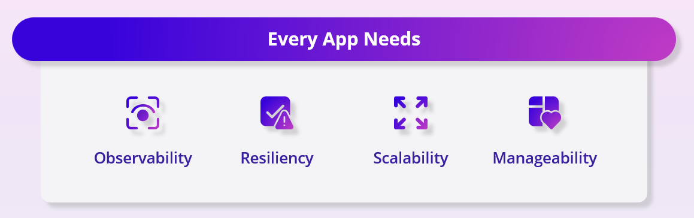
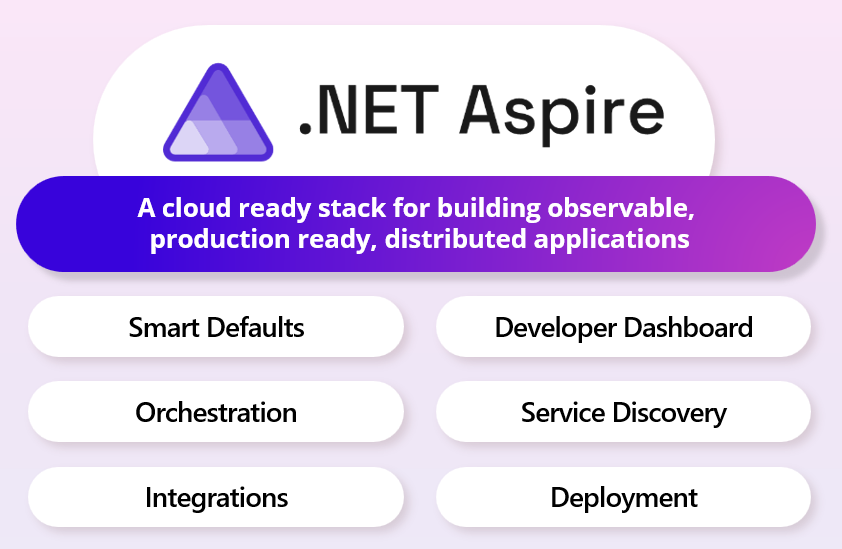
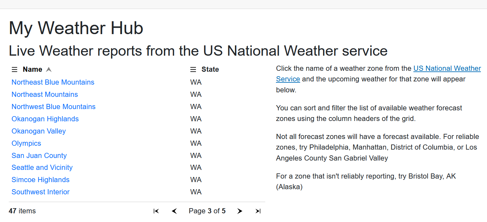

# Introducing .NET Aspire and our sample project

Welcome to our lab introducing .NET Aspire.  Over the course of this material we will learn what .NET Aspire is, how to add it to an existing application, and how to use .NET Aspire to meet our growing application needs.

## What are the problems .NET Aspire is going to solve

In working with customers, the .NET team recognized that applications have a common pattern of needs:

These are difficult problems to solve with consistent, high quality solutions that evolve with your application.  .NET Aspire was designed to meet those needs with a concrete opinionated implementation.

## What is .NET Aspire and how does it solve these problems

.NET Aspire is a stack, a collection of libraries and tools that address these needs for any application.  These concerns are addressed through five key tenets of .NET Aspire:

- **Orchestration:** Use C# and familiar APIs to model your distributed application without a line of YAML. Easily add popular databases, messaging systems, and cloud services, connect them to your projects, and run locally with a single click.
- **Service Discovery:** Automatic injection of the right connection strings or network configurations and service discovery information to simplify the developer experience.
- **Integrations:** Built-in integrations for common cloud services like databases, queues, and storage. Configured for logging, health checks, telemetry, and more.
- **Dashboard:** Live OpenTelemetry data is available with no configuration required. Launched by default on run, .NET Aspire's developer dashboard shows logs, environment variables, distributed traces, metrics and more to quickly verify app behavior.
- **Deployment:** Easily produce a manifest of all the configuration your application resources require to run in production. Optionally, quickly and easily deploy to Azure Container Apps or Kubernetes using Aspire-aware tools.

You don't need to be building the next massive enterprise application or search engine to benefit from .NET Aspire.  Every application benefits from the smart defaults, developer dashboard, simplified logging, metrics reporting, and optimized deployment capabilities.

## Looking ahead - our sample application

In this workshop, we're going to take a simple Blazor Interactive Server web application and introduce each of the facets of .NET Aspire to it.  The Blazor application, MyWeatherHub, is a front-end that uses a separate Api microservice to connect and interact with the American National Weather Service to report the current weather.

It can be a little tricky to get the current application running properly with two web applications that need to be started in the correct order, that need to locate each other, and have no real logging support for when connectivity problems occur between the website, the Api, and the National Weather Service.

This can be done in Visual Studio by configuring multiple startup projects, or running the Api before starting the web application at the command-line.  Give it a try with the sample code provided and search for an American city or state and the app should report weather for you.  Be sure to watch the console for both the web application and the api to see the reports of interaction between the two projects.